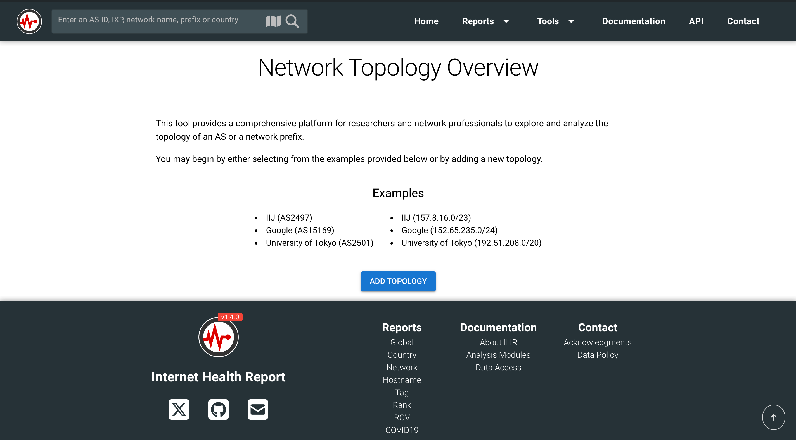
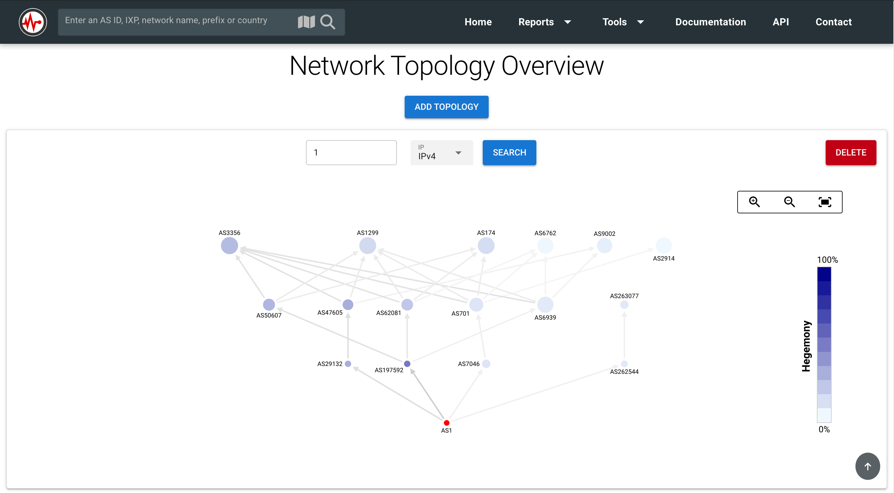
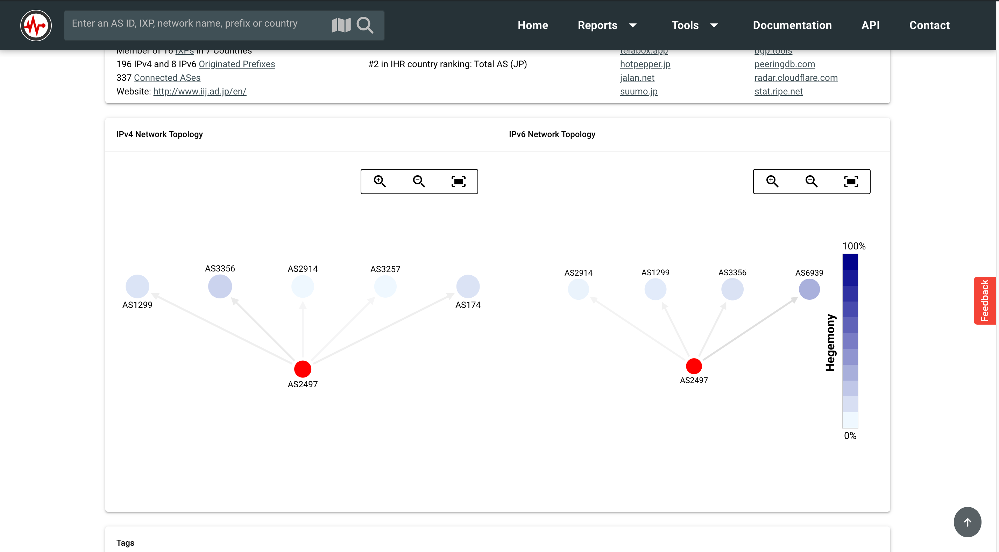
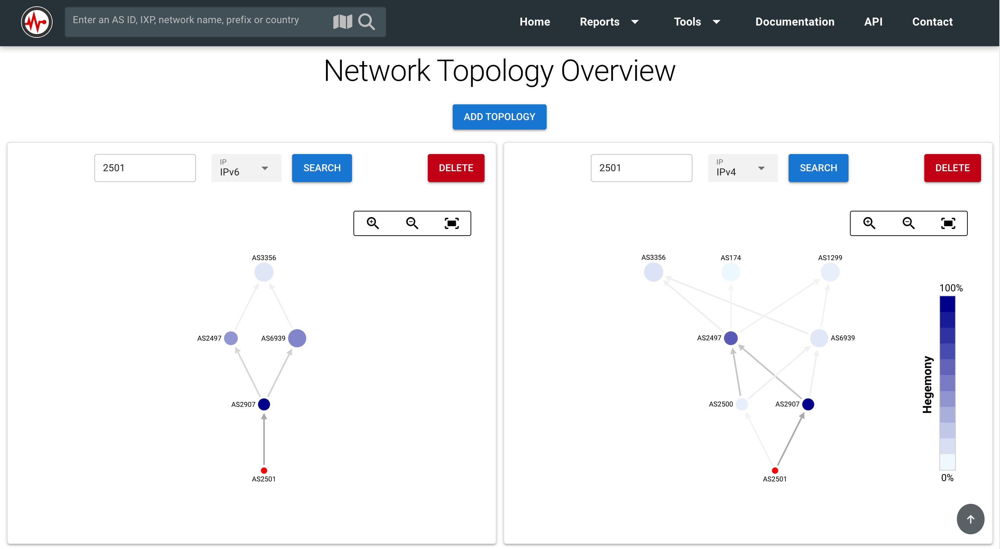

# Google Summer of Code 2024

**Project page**: [Network Topology Overview](https://summerofcode.withgoogle.com/programs/2024/projects/20hbhwVa)
 
**Organisation**: [Internet Health Report](https://ihr.iijlab.net/)
 
**Mentors**: [Romain](https://github.com/romain-fontugne), [Dimitrios](https://github.com/dpgiakatos)
 
**Proposal**: [Network Topology Overview](IHR-Proposal-Utkarsh.pdf)

## Overview

The project's objective was to develop a visual representation of network connectivity, focusing on Autonomous Systems (AS) and IP prefixes. The project successfully achieved this goal by implementing a customizable chart that enhances data visualization. This tool serves as a standalone resource for researchers and is also integrated into the comprehensive reports page.

Additionally, I introduced a feature that allows users to compare AS and prefix data side by side, with the added capability of generating shareable links for collaboration with others. This functionality significantly enhances the tool's usability and facilitates more effective data analysis and sharing.

## Screenshots

**1. Main page of the Tool**

**2. Network Topology of a AS1**

**3. Network Topology Integration in Reports Page**

**4. Network Topology in comparision mode**

## Code Written

The complete code I developed for this project is available in the [`gsoc24`](https://github.com/InternetHealthReport/ihr-website/tree/gsoc24) branch of the repository.

## Pull Requests

- [Integration of gsoc24 branch to dev branch](https://github.com/InternetHealthReport/ihr-website/pull/825)
- [Other PRs](https://github.com/InternetHealthReport/ihr-website/commits/gsoc24/?author=0xAnon0602&since=2024-06-01&until=2024-08-31)

## Libraries Used

- [v-network-graph](https://dash14.github.io/v-network-graph/)
- [Grid Layout Plus](https://grid-layout-plus.netlify.app/)

## Acknowledgments

I would like to thank my mentors [Romain](https://github.com/romain-fontugne) and [Dimitrios](https://github.com/dpgiakatos) for their encouragement, perspectives, and constant support. This time, apart from becoming a better developer, the experience also taught me about the process of scaling and maintaining an open-source project in a way that enables other developers to contribute seamlessly. I extend my gratitude to the GSoC team at Google for making it possible to contribute and work with this amazing team of people from across the world.

I would also like to express my gratitude to the libraries mentioned above, which made it possible for me to complete the project with ease.

